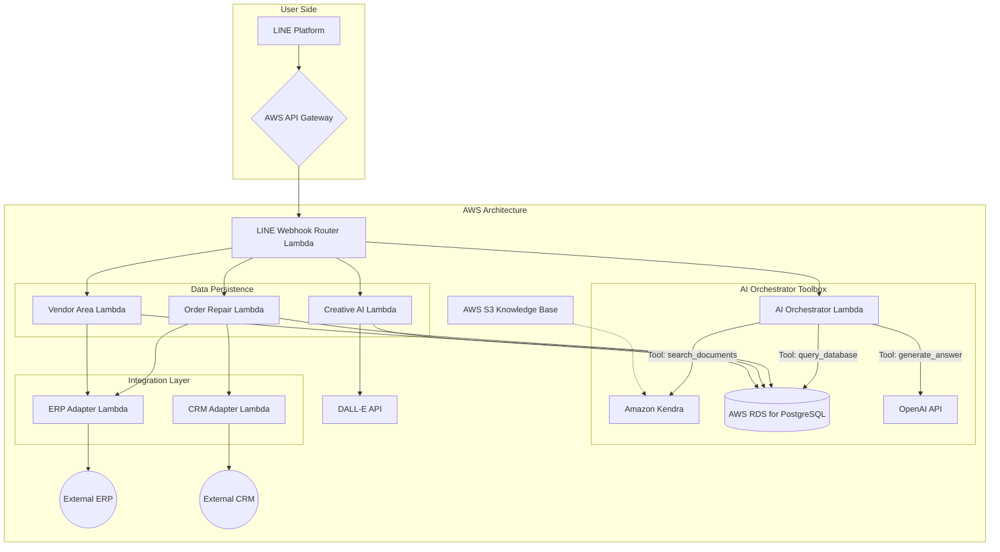

# AI 整合專案系統設計書 (v1.6 - 完整版)

本文檔基於 `requirements.md` v1.0 進行高階系統設計，旨在定義專案的主體架構、核心組件、資料模型、外部接口及重要的非功能性原則，作為後續開發的指導藍圖。

## 1. 系統架構圖 (修正版)

本專案採用以 AWS 為基礎的無伺服器 (Serverless) 架構。AI 客服模組將升級為「AI 協同器」，使其能判斷並使用多種工具（文件檢索、資料庫查詢）來回應使用者問題。



## 2. 核心組件說明

### 2.1. AI 協同器與 RAG 相關組件
- **AI Orchestrator Lambda (原 AI 客服 Lambda)**
    - **職責**：作為 AI 問答的核心中樞，負責理解使用者意圖，並協調不同的工具（Kendra, RDS, OpenAI）來生成最準確的答案。
    - **功能**：採用「工具使用 (Tool Use)」模式。接收到問題後，它會先請求 LLM 判斷應使用哪一個或哪些工具，然後執行工具呼叫，最後整合工具回傳的資訊，生成最終回覆。
- **AWS S3 (Knowledge Base)**
    - **職責**：儲存所有作為 AI 客服知識來源的**非結構化**文件（如：PDF, DOCX, TXT 格式的 FAQ、產品手冊、公司政策等）。
- **Amazon Kendra**
    - **職責**：作為 RAG 的核心**文件檢索**服務。Kendra 會自動同步 S3 中的文件，建立可供語意搜尋的索引。

### 2.2. 其他功能 Lambdas
- **Order/Repair Lambda**：處理訂單查詢、維修申請與進度追蹤，透過抽象層呼叫 ERP/CRM 接口。
- **Vendor Area Lambda**：處理廠商登入驗證與專屬資料查詢，透過抽象層呼叫 ERP 接口。
- **Creative AI Lambda**：處理使用者輸入的創意文字，串接 DALL·E API 生成圖像並回傳。

### 2.3. 其他核心組件
- **AWS API Gateway**：作為整個系統的統一入口，負責請求的路由、驗證、流量控制等。
- **LINE Webhook Router Lambda**：解析來自 LINE 的請求，並觸發下游對應的功能 Lambda。
- **整合抽象層 (ERP/CRM Adapters)**：封裝與外部 ERP/CRM 系統的通訊邏輯，實現解耦。

## 3. AI 協同與工具使用設計 (AI Orchestration & Tool-Use Design)

此設計旨在讓 AI 能同時利用「文件知識」和「資料庫數據」。

### 3.1. 資料來源選擇策略 (補充說明)

一個常見的問題是：「為何不直接用 Kendra 的資料庫連接器，把 RDS 的資料都彙整進去？」

答案在於**資料的即時性**與**任務的適用性**。我們的策略是讓 AI 協同器去選擇最適合的工具：

- **Kendra 的角色 (處理非結構化知識)**：Kendra 確實可以連接 RDS，但其同步機制是**排程、非即時**的。這非常適合處理**變動頻率低**的資料，例如：產品手冊、公司政策、FAQ。我們將這類資料放在 S3，由 Kendra 建立索引，透過 `search_documents` 工具來查詢。

- **RDS 的角色 (處理結構化數據)**：對於**即時性要求高**的數據，例如：商品價格、庫存數量、訂單最新狀態，我們需要查詢當下的第一手資料。因此，我們設計了 `query_database` 工具，讓 AI 可以**直接**向 RDS 資料庫進行查詢，獲取最準確的即時數據。

這個「多工具」模式，避免了將所有資料都「扁平化」到 Kendra 的限制，確保了在處理不同問題時，都能使用最高效、最準確的資料來源。

### 3.2. 定義工具 (Tool Definition)
1.  **`search_documents(query: string)`**
    - **功能**：當問題涉及政策、指南、描述性資訊時使用。
    - **執行**：呼叫 Amazon Kendra 的 `Retrieve` API。
2.  **`query_database(parameters: object)`**
    - **功能**：當問題涉及精確、即時的數據（如價格、庫存、規格）時使用。
    - **執行**：**(安全強化說明)** 為完全杜絕 SQL 注入風險，此工具**不應**接受原始 SQL 字串。反之，LLM 需生成一個結構化的物件 (如 `{"action": "get_price", "product_sku": "AKE001"}`)。Lambda 內部程式碼再根據 `action` 執行預先定義好的、參數化的安全 SQL 查詢。

### 3.3. 運作流程範例
**使用者問題**：「我想知道經典款休閒鞋的價格，以及退貨政策是什麼？」

1.  **意圖判斷**：`AI Orchestrator Lambda` 將問題和工具列表傳給 LLM (OpenAI)。LLM 判斷需要使用**兩種**工具。
2.  **工具呼叫 (平行執行)**：
    - Lambda 呼叫 `query_database` 來查詢「經典款休閒鞋」的價格。
    - Lambda 同時呼叫 `search_documents` 來查詢「退貨政策」。
3.  **資訊蒐集**：Lambda 等待兩個工具的執行結果。
    - `query_database` 回傳：`{ price: 2580 }`
    - `search_documents` 回傳：`「退貨政策：...7天內可退...」`
4.  **最終生成**：Lambda 將蒐集到的資訊，連同原始問題，再次傳給 LLM，並下達指令：「請根據以下資訊，彙整成一個完整的答案」。
5.  **回傳答案**：LLM 生成：「經典款休閒鞋的價格是 2580 元。關於退貨政策，我們提供7天內的退貨服務...」。Lambda 將此答案回傳給使用者。

## 4. 通用接口假設 (Generic Interface Definitions)

為了讓開發可以先行，我們定義以下內部標準的 JSON 接口格式。

### 4.1. ERP Adapter 接口

- **查詢訂單狀態**
    - `Request (to ERP Adapter)`: `{ "action": "GET_ORDER_STATUS", "payload": { "orderId": "ORD-123456" } }`
    - `Response (from ERP Adapter)`: `{ "success": true, "data": { "orderId": "ORD-123456", "status": "SHIPPED", "shippingDate": "2025-10-20", "items": [{"sku": "SHOE-001", "name": "經典款休閒鞋", "quantity": 1}] } }`

- **查詢維修進度**
    - `Request`: `{ "action": "GET_REPAIR_STATUS", "payload": { "repairId": "REP-78901" } }`
    - `Response`: `{ "success": true, "data": { "repairId": "REP-78901", "status": "IN_PROGRESS", "estimatedCompletionDate": "2025-10-25" } }`

### 4.2. CRM Adapter 接口

- **查詢客戶基本資料 (僅供即時顯示，不儲存)**
    - `Request`: `{ "action": "GET_CUSTOMER_INFO", "payload": { "lineUserId": "U123456789..." } }`
    - `Response`: `{ "success": true, "data": { "name": "林先生", "level": "VIP" } }`

## 5. 資料庫初步規劃 (AWS RDS for PostgreSQL)

以下是核心業務所需的資料表初步規劃。

- **`line_conversations`** (LINE 對話紀錄)
    - `id` (PK, SERIAL)
    - `line_user_id` (VARCHAR)
    - `message_type` (VARCHAR) -- text, image, etc.
    - `content` (TEXT) -- 訊息內容或圖片 URL
    - `source` (VARCHAR) -- user, bot
    - `created_at` (TIMESTAMP)

- **`ai_generations`** (AI 生成內容紀錄)
    - `id` (PK, SERIAL)
    - `line_user_id` (VARCHAR)
    - `generation_type` (VARCHAR) -- image, text
    - `prompt` (TEXT) -- 使用者輸入的提示
    - `response_content` (TEXT) -- 生成的文字或圖片 URL/S3 Key
    - `model_used` (VARCHAR) -- e.g., DALL-E 3, GPT-4
    - `created_at` (TIMESTAMP)

- **`app_logs`** (應用程式日誌)
    - `id` (PK, SERIAL)
    - `lambda_name` (VARCHAR)
    - `log_level` (VARCHAR) -- INFO, WARN, ERROR
    - `message` (TEXT)
    - `details` (JSONB)
    - `created_at` (TIMESTAMP)

- **`vendor_auth`** (廠商驗證碼)
    - `vendor_code` (PK, VARCHAR)
    - `verification_code` (VARCHAR, HASHED)
    - `is_active` (BOOLEAN)
    - `updated_at` (TIMESTAMP)

## 6. 非功能性設計原則 (Non-Functional Design Principles)

本章節定義指導專案實作的關鍵非功能性需求與策略。

### 6.1. 安全性設計 (Security by Design)
- **權限最小化原則 (Least Privilege)**：所有 IAM Role (特別是 Lambda 的執行角色) 都必須遵循權限最小化原則。每個角色僅能存取其執行任務所嚴格必需的資源。
- **秘密管理 (Secrets Management)**：所有敏感資訊，包括 API Keys, 資料庫密碼, 外部服務憑證等，都**必須**透過 **AWS Secrets Manager** 進行儲存與管理。Lambda 在執行階段動態讀取，嚴禁將任何密鑰硬編碼 (hardcode) 在程式碼或環境變數中。
- **API Gateway 授權**：所有對外的 API 端點需設定授權機制。來自 LINE 的 Webhook 請求需驗證其 X-Line-Signature。若未來有其他 API 端點，需評估使用 API Keys 或 IAM Authorizer。

### 6.2. 監控與日誌 (Monitoring & Logging)
- **集中式日誌 (Centralized Logging)**：所有 Lambda 函數的 Log 都應以結構化 JSON 格式輸出，並集中串流至 **Amazon CloudWatch Logs**，以便於搜尋、分析與監控。
- **告警機制 (Alerting)**：需針對關鍵指標建立 CloudWatch Alarms，例如：
    - 關鍵 Lambda (如 AI Orchestrator) 的錯誤率 (Errors) 或調用失敗 (Invocations Failed)。
    - API Gateway 的 5XX 錯誤率。
    - 當警報觸發時，需透過 **Amazon SNS** 發送通知給維運團隊。
- **分散式追蹤 (Distributed Tracing)**：建議啟用 **AWS X-Ray**，以追蹤橫跨 API Gateway, Lambda, 以及其他 AWS 服務的請求鏈路，這在複雜問題的根因分析 (Root Cause Analysis) 中至關重要。

### 6.3. 部署策略 (Deployment Strategy)
- **程式語言與執行環境 (Language & Runtime)**：本專案所有 AWS Lambda 函數應採用 **Node.js** (建議 18.x 或更高版本) 進行開發。
- **基礎設施即程式碼 (Infrastructure as Code, IaC)**：本專案**應**採用 **AWS SAM (Serverless Application Model)** 進行開發與部署。所有 AWS 資源（Lambda, API Gateway, IAM Roles, DynamoDB Tables 等）都必須在 `template.yaml` 檔案中進行定義。
- **部署流程**：標準部署流程應包含 `sam build` 和 `sam deploy`。所有環境（開發、測試、生產）的部署都應透過此自動化流程執行，禁止手動於 AWS Console 進行資源變更。
- **環境隔離**：應為開發 (dev), 測試 (staging), 生產 (prod) 環境建立不同的 AWS 帳號或至少是不同的 Region/Resource Prefix，以確保環境間的完全隔離。

## 7. LINE 平台整合設計 (LINE Platform Integration Design)

本章節詳細定義本專案與 LINE Platform 對接的技術細節與標準作法。

### 7.1. 核心憑證與管理

- **Channel Secret**: 用於驗證 Webhook 請求的簽章，確保請求來自 LINE Platform。此密鑰應儲存在 **AWS Secrets Manager** 中。
- **Channel Access Token**: 用於代表我們的服務主動呼叫 LINE API（如回覆、推播訊息）的憑證。此 Token **必須**儲存在 **AWS Secrets Manager** 中，由 Lambda 在執行時動態讀取。

### 7.2. Webhook 處理流程

1.  **端點 (Endpoint)**：LINE Platform 會將使用者事件，透過 HTTP POST 請求，發送到我們在 **AWS API Gateway** 上設定的 `/line/webhook` 端點。
2.  **觸發**：API Gateway 接收到請求後，會直接觸發後端的 **LINE Webhook Router Lambda**。
3.  **簽章驗證 (Signature Validation)**：Router Lambda 的**第一項任務**，是從請求標頭 (Header) 中取出 `X-Line-Signature` 的值，並使用 `Channel Secret` 進行驗證。此步驟至關重要，用以確保請求的合法性，防止偽冒請求。官方的 `@line/bot-sdk` 中間件已包含此功能。

### 7.3. 官方 SDK 使用

- **標準化開發**：為簡化開發並遵循最佳實踐，所有與 LINE Messaging API 的互動，都**應**使用官方提供的 Node.js SDK: **`@line/bot-sdk`**。
- **客戶端初始化 (Client Initialization)**：在 Lambda 的程式碼中，應如下初始化客戶端：

  ```javascript
  const line = require('@line/bot-sdk');

  // 從環境變數或 Secrets Manager 讀取憑證
  const config = {
    channelAccessToken: process.env.CHANNEL_ACCESS_TOKEN,
    channelSecret: process.env.CHANNEL_SECRET,
  };

  const client = new line.Client(config);
  ```

### 7.4. LIFF (LINE Front-end Framework) 整合

- **前端**：LIFF 頁面本質上是運行在 LINE 內建瀏覽器的網頁。前端開發者可使用 LIFF SDK 來獲取使用者的 LINE User ID 等資訊。
- **後端通訊**：當 LIFF 頁面需要與我方後端服務互動時（例如：提交維修申請表單），它應呼叫獨立的、專為 LIFF 設計的 API 端點（例如：`/api/liff/repair-request`），而不是共用 `/line/webhook` 端點。這些 LIFF 專用的 API 端點同樣由 API Gateway 管理，並觸發對應的後端 Lambda（如 `Order/Repair Lambda`）。
